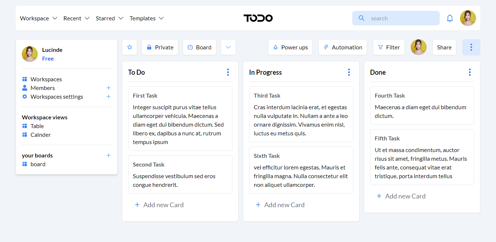

# Front-end Task (Todo App)




## How to run the project

after cloning the project go the project directory and run these commands

```
npm install
npm run dev
```

## app features

- Add new task to any category
- Drag and drop tasks between columns
- The tasks are saved on the local storage
